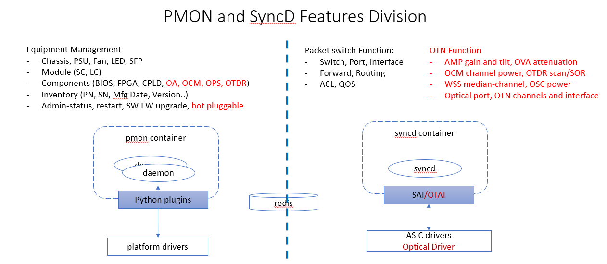
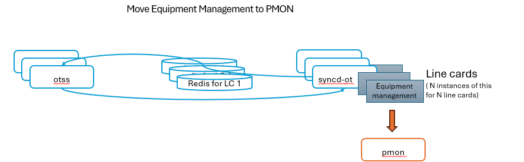
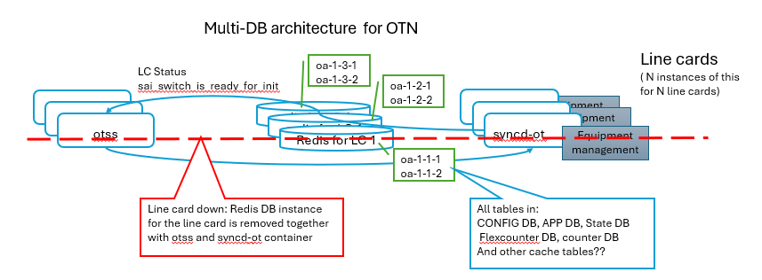
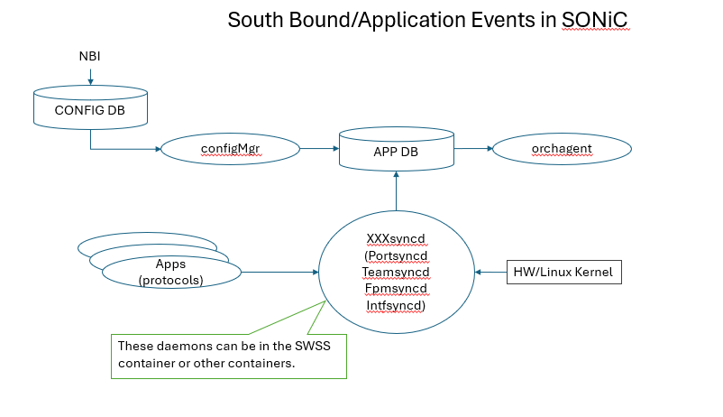

# PMON Enhancement for OTN

This design document propose the PMON modification and enhancement for support OTN device.

## Table of Contents

- [PMON Enhancement for OTN](#pmon-enhancement-for-otn)
  - [Table of Contents](#table-of-contents)
  - [1 Introduction](#1-introduction)
    - [1.1 PMON and SyncD Functional Scope](#11-pmon-and-syncd-functional-scope)
    - [1.2 OTN Device Support](#12-otn-device-support)
  - [2 Reuse Existing PMON Features](#2-reuse-existing-pmon-features)
    - [2.1 Python Base Class](#21-python-base-class)
    - [2.2 Line Card APIs](#22-line-card-apis)
    - [2.3 Component APIs](#23-component-apis)
    - [2.4 Device Specific Modules and Drivers](#24-device-specific-modules-and-drivers)
  - [3 Line Card Management](#3-line-card-management)
    - [3.1 Requirement](#31-requirement)
    - [3.2 Exiting OTN Design](#32-exiting-otn-design)
    - [3.3 APP DB and *syncd Mechanism](#33-app-db-and-syncd-mechanism)
    - [Introduce `linecardsyncd`](#introduce-linecardsyncd)
  - [4 PM Feature](#4-pm-feature)

## 1 Introduction

### 1.1 PMON and SyncD Functional Scope

In SONiC architecture, switch's packet service (data plane) functionality, defined by SAI, is supported by SWSS and SyncD containers. PMON (platform monitor) container manages generic hardware. The functional partition of PMON and SyncD can be illustrated in the following diagram:



In above diagram, packet switching data plane functional objects are created to config and monitoring switch ASIC. The data plane objects include port, interface, MAC, vLan, routing table, ACL and QOS etc. Note that these objects are not necessary have direct corresponding hardware modules/components. Meanwhile, PMON is responsible for managing the hardware aspect of the device, which is independent from what service the device is providing. These generic hardware objects includes chassis, supervisor card, line card, fan, PSU and various components (CPLD, FPGA, BIOS etc.).

### 1.2 OTN Device Support

For OTN devices, by following the same principle, all optical service-related functions provided are supported by SyncD via SAI. These functions include gain, tilt, wavelength-median-channel, OTDR scan, OCM channel power in an OLS device. In a transponder, transport service objects include physical/logical channels, client/network interfaces, channel association, etc. These OTN objects and attributes will be added into SAI and implemented in SWSS/SyncD. 
At the same time, physical hardware at different levels should be managed by PMON. As a result, all generic hardware (line card and optical components) management features are removed from legacy OTN SAI (OTAI) and they will be supported by PMON.



  1. removed [inventory (manufacturing info)](https://github.com/Weitang-Zheng/SAI/commit/0231d7b90e4acd2a545edde5716293ed15e91b7f) of line card and components.
  2. removed line card and components [SW/FW upgrade](https://github.com/Weitang-Zheng/SAI/commit/29ebf09ab4ae93bee8210e74792579eb86608e91).
  3. removed [LED definition](https://github.com/Weitang-Zheng/SAI/commit/011036d81e1e54b60854ae2c3ff8c066650bee0a).
  4. removed [line card ready status](https://github.com/Weitang-Zheng/SAI/commit/d9d1afdfc340a2293997be3b4874f5010da8dd63), support hot-pluggable, line card management in general, in PMON.

1 to 3 above are already supported by existing PMON, these features can be reused for OTN devices, as described in the next section. However, current PMON does not support line card hot-pluggable which needs to be enhanced.

## 2 Reuse Existing PMON Features

PMON infrastructure is implemented in two repositories, [sonic-platform-common](https://github.com/sonic-net/sonic-platform-common) and [sonic-platform-daemon](https://github.com/sonic-net/sonic-platform-daemons) described in [this doc](https://github.com/sonic-net/SONiC/blob/master/doc/platform_api/new_platform_api.md). And Vendor platform module resides under `sonic-buildimage/platform` and `sonic-buildimage/device` folders for each device type.

### 2.1 Python Base Class

Python classes are implemented to model the generic hardware structure and operations on the hardware. Here is the example of a typical device structure in python classes:

```text
- Chassis
    - System EEPROM info
    - Reboot cause
    - Environment sensors
    - Front panel/status LED
    - Power supply unit[0 .. p-1]
    - Fan[0 .. f-1]
    - Module[0 .. m-1] (Line card, supervisor card, etc.)
      - Environment sensors
      - Front-panel/status LEDs
      - SFP cage[0 .. s-1]
      - Components[0 .. n-1] (CPLD, FPGA, Optical modules)
        - name 
        - description
        - firmware
```

Note that all optical modules, OA, OCM, VOA, OTDR and WSS etc. are modeled as `Components` within a line card in PMON.

### 2.2 Line Card APIs

In PMON a `module` represents a pluggable card in OTN devices, whose management functionality is implemented by a python class [`mudule_base.py`](https://github.com/sonic-net/sonic-platform-common/blob/master/sonic_platform_base/module_base.py). Some relevant APIs are listed below:

``` python
    def get_system_eeprom_info(self):
        """
        Retrieves the full content of system EEPROM information for the module
        """
    def get_oper_status(self):
        """
        Returns:
            predefined status values: MODULE_STATUS_EMPTY, MODULE_STATUS_OFFLINE,
            MODULE_STATUS_FAULT, MODULE_STATUS_PRESENT or MODULE_STATUS_ONLINE
        """
    def reboot(self, reboot_type):
        """
        Args:
            predefined reboot types: MODULE_REBOOT_DEFAULT, MODULE_REBOOT_CPU_COMPLEX, etc..
        """
    def set_admin_state(self, up):
        """
        Args:
            up: A boolean, True to set the admin-state to UP. False to set the admin-state to DOWN.
        """
    def get_reboot_cause(self):
        """
        Retrieves the cause of the previous reboot of the DPU module
        """
    def get_all_components(self):
        """
        Retrieves all components available on this module
        """
```

***PMON Enhancement:***

add `upgrade_software()` API for upgrade software running on line card CPU.

### 2.3 Component APIs

In OTN project, optical modules (OA, VOA, OCM, OPS, OTDR) are modeled as components for generic monitoring and operations. We can use componentType+slot+number as optical component names (slot and component number is 0 based). For example, second EDFA in slot 1 is configured as:

```text
name: OA0-1
description: variable gain EDFA
firmware: 3.0.0.1
```

This name convention must be exactly same as specified in [Redis schema tables](./../otn_redis_schema.md) introduced by OTN. This is required for the line card hot-pluggable management.

**TODO:**
Need to finalize the name convention:

- `componentTypeSlot-number` 0 based, (OA0-1). This seems the current PMON convention.
- `componentType-chassisId-slot-number` 1 based, (OA-1-1-1), used in current OTN.

In [`component_base.py`](https://github.com/sonic-net/sonic-platform-common/blob/master/sonic_platform_base/component_base.py) applicable API of components including:

```python
    def get_name(self):
        """
        Retrieves the name of the component
        """
    def get_description(self):
        """
        Retrieves the description of the component
        """
    def get_firmware_version(self):
        """
        Retrieves the firmware version of the component
        """
    def update_firmware(self, image_path):
        """
        Updates firmware of the component
        """
```

SONiC provide a generic mechanism to install/upgrade firmware, [fwutil.md](https://github.com/sonic-net/SONiC/blob/master/doc/fwutil/fwutil.md) and OTN vendor need to implement above firmware related APIs.

***PMON Enhancement (TBD)***:

- add `get_type()` API to find out component type: OA, VOA, WSS, OTDR etc. This is useful for hot-pluggable discussed late.
- add `get_system_eeprom_info()` for component manufacture info.
- add `get_oper_status()` to support pluggable components.

### 2.4 Device Specific Modules and Drivers

In pmon container, sonic-platform-common and sonic-platform-daemon is the infrastructure and common code (python base class) for all devices. Device specific code (python sub class + drivers) resides in platform folder. For example, here is the [drivers](https://github.com/sonic-net/sonic-buildimage/tree/master/platform/broadcom/sonic-platform-modules-dell/s6000/sonic_platform) of a Dell switch `s6000` based on Broadcom ASIC. and the device hardware hierarchy is defined in [platform.json](https://github.com/sonic-net/sonic-buildimage/blob/master/device/dell/x86_64-dell_s6000_s1220-r0/platform.json) for the same device.

With PMON drivers (python subclass) implemented for an OTN device, all existing CLI for the generic hardware would work, with no changes. An example of PMON CLIs of a OLS device is shown as following:


## 3 Line Card Management

### 3.1 Requirement

Currently, SONiC support two chassis types:

- Pizza box without pluggable supervisor/control card and line cards.
- Chassis based with supervisor card and line card. Each line card has ASIC which is a full functional switch and SONiC is running on line card CPU as well. Multi-DB architecture is used to support multi-ASIC devices.

For an OTN device with pizza box form fact, the existing PMON can be reused as described above. No line card management is needed and single DB instance (host Redis instance) is used.

For a chassis based OTN device, it has pluggable control card and a number of line cards containing various optical and OEO modules. Different from SONiC multi-chassis, a line card of an OTN device usually has no SONiC running on it. Therefore, existing SONiC need to be enhanced to address OTN device's hardware form fact, i.e., line card management.

- When a line card is offline (faults, unplugged, restart etc..), the components on the line card becomes unmanageable, no control and monitor are available.  All SAI objects corresponding to these components should be removed. The state data of these components should be updated in the state DB as well.
- When a line card becomes online (fault recovered or startup completed), the components on the line card are under management.  All SAI objects corresponding to these components should be created/restored. The state data of these components should be updated in the state DB as well.

### 3.2 Exiting OTN Design

The legacy OTN design adopt multi-ASIC architecture where each line card and its components are managed by an dedicated Redis instance with corresponding OTSS and syncd-ot containers. Show as the following:



In this architecture, each line card has a dedicated Redis instance contains all tables in Config DB, APP DB, State DB, Flexcounter DB and Counter DB etc. There are also corresponding otss and syncd-ot containers running.

When a line card is down, SyncD detects lost communication to the line card and the SAI API `sai_switch_is_ready_for_init` returns false and the corresponding Redis instance and otss and syncd-ot containers for this line card will be shutdown to disable further management functions on this line card.

When the line card is back in service, its corresponding Redis instances and otss and syncd-ot containers are brought up. The config file for that line card is restored into Config DB and the line card is under management again.

As we discussed, now the line card management as generic hardware is moved to PMON. PMON need to be enhanced to provide the same functionality above.

### 3.3 APP DB and *syncd Mechanism

In a SONiC system, there are three sources of events can effect the system state.

- Configuration change from NBI.
- Hardware, Linux kernel events.
- Events from other applications.

APP DB stores the state generated by all application containers -- routes, next-hops, neighbors, etc. This is the south-bound entry point for all applications wishing to interact with other SONiC subsystems. The xxsyncd mechanism provides the means to allow connectivity between SONiC applications and SONiC's centralized message infrastructure (redis-engine). These daemons are typically identified by the naming convention being utilized: *syncd. Please see more description in SONiC [Architecture](https://github.com/sonic-net/SONiC/wiki/Architecture). This mechanism is illustrated in the following diagram.



For example:

- Intfsyncd: Listens to interface-related netlink events and push collected state into APPL_DB. Attributes such as new/changed ip-addresses associated to an interface are handled by this process.
- Fpmsyncd: Previously discussed -- running within bgp docker container. Again, collected state is injected into APP DB.

### Introduce `linecardsyncd`

Follow the `*syncd` design pattern, `linecardsyncd` is proposed to make PMON as application to interact with the core of optical service, orchagent and SyncD

## 4. PM Feature

Current PMON does not support PM counter feature. A HLD is proposed to support PM for the generic hardware. See [here for HLD](../otn_pmon_hld.md).