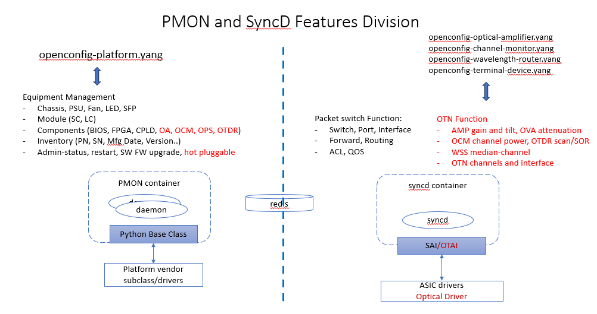
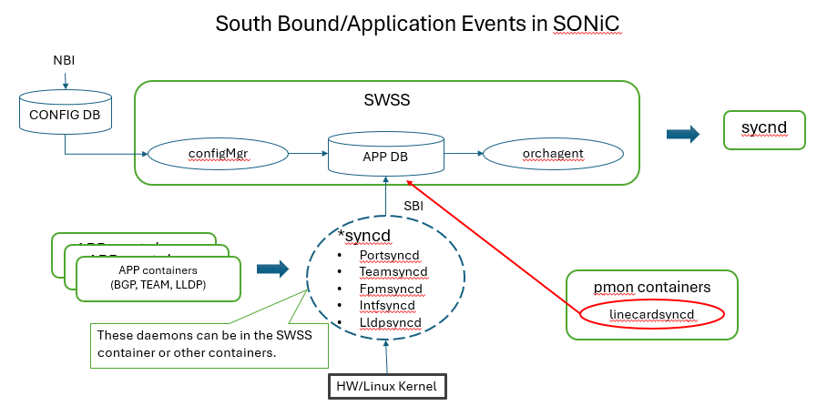

# PMON Enhancement for OTN

This design document proposes PMON modification and enhancement for supporting generic hardware aspect of OTN devices.

## Table of Contents

- [PMON Enhancement for OTN](#pmon-enhancement-for-otn)
  - [Table of Contents](#table-of-contents)
  - [1 Introduction](#1-introduction)
    - [1.1 PMON and SyncD Functional Scope](#11-pmon-and-syncd-functional-scope)
    - [1.2 SAI/OTAI API Adjustment](#12-saiotai-api-adjustment)
  - [2 Reuse Existing PMON Features](#2-reuse-existing-pmon-features)
    - [2.1 Python Base Class](#21-python-base-class)
    - [2.2 Line Card APIs](#22-line-card-apis)
    - [2.3 Component APIs](#23-component-apis)
    - [2.4 Component Name Convention](#24-component-name-convention)
    - [2.5 Device Specific Modules and Drivers](#25-device-specific-modules-and-drivers)
  - [3 Line Card Management](#3-line-card-management)
    - [3.1 Requirement](#31-requirement)
    - [3.2 Existing OTN Design](#32-existing-otn-design)
    - [3.3 APP DB and \*synced Mechanism](#33-app-db-and-synced-mechanism)
    - [3.4 `linecardsynced` Design](#34-linecardsynced-design)
    - [3.5 Further Discussion](#35-further-discussion)
  - [4. PM Feature](#4-pm-feature)

## 1 Introduction

### 1.1 PMON and SyncD Functional Scope

In SONiC architecture, switch's packet service (data plane) functionality, defined by SAI, is supported by SWSS and SyncD containers. PMON (platform monitor) container manages generic hardware. The functional partition of PMON and SyncD can be illustrated in the following diagram:



In the above diagram, functional objects for packet switching data plane features are created to config and monitor switch ASIC. The data plane objects include port, interface, MAC, vLan, routing table, ACL and QOS etc. Note that these objects are not necessary have 1 to 1 mapping to hardware modules/components. Meanwhile, PMON is responsible for managing the hardware aspect of the device, which is decoupled from what service the device is providing. These generic hardware objects represents the device HW hierarchy including chassis, supervisor card, line card, fan, PSU and various components (CPLD, FPGA, BIOS etc.).

For OTN devices, by following the same principle:

- Optical service-related functions are supported by SyncD via SAI. These functions include gain, tilt, wavelength-median-channel, OTDR scan, OCM channel power in an OLS device. In a transponder, transport service objects include physical/logical channels, client/network interfaces, channel association, etc. These OTN objects and attributes will be added into SAI and implemented in SWSS/SyncD. These functions are corresponding to the [openconfig optical-transport yang models](https://github.com/openconfig/public/tree/master/release/models/optical-transport).
- There is no difference between hardware structure of a OTN device and other network device (Switch/Router), whether it is a pizza box or chassis based. Therefore, most hardware management is already supported by PMON. Interestedly, PMON adopts the same/similar data model for generic hardware defined by [openconfig-platform.yang](https://github.com/openconfig/public/blob/master/release/models/platform/openconfig-platform.yang).

### 1.2 SAI/OTAI API Adjustment

Based on above discussion, it is decided that all generic hardware (line card and optical components) management features are removed from legacy OTN SAI (OTAI) and need to be supported by PMON.


  1. removed [inventory (manufacturing info)](https://github.com/Weitang-Zheng/SAI/commit/0231d7b90e4acd2a545edde5716293ed15e91b7f) of line card and components.
  2. removed line card and components [SW/FW upgrade](https://github.com/Weitang-Zheng/SAI/commit/29ebf09ab4ae93bee8210e74792579eb86608e91).
  3. removed [LED definition](https://github.com/Weitang-Zheng/SAI/commit/011036d81e1e54b60854ae2c3ff8c066650bee0a).
  4. removed [line card ready status](https://github.com/Weitang-Zheng/SAI/commit/d9d1afdfc340a2293997be3b4874f5010da8dd63), support hot-pluggable, line card management in general, in PMON.

1 to 3 above are already supported by existing PMON. These features can be mostly reused for OTN devices, as described in the next section. However, due some current PMON does not support line card hot-pluggable and other operations. These new requirement will be addressed in Section 3.

## 2 Reuse Existing PMON Features

PMON infrastructure is implemented in two repositories, [sonic-platform-common](https://github.com/sonic-net/sonic-platform-common) and [sonic-platform-daemon](https://github.com/sonic-net/sonic-platform-daemons) described in [this doc](https://github.com/sonic-net/SONiC/blob/master/doc/platform_api/new_platform_api.md). And Vendor platform module resides under `sonic-buildimage/platform` and `sonic-buildimage/device` folders for each device type.

### 2.1 Python Base Class

Python classes are implemented to model the generic hardware structure and operations on the hardware. Here is the example of a typical device structure in python classes:

```text
- Chassis
    - System EEPROM info
    - Reboot cause
    - Environment sensors
    - Front panel/status LED
    - Power supply unit[0 .. p-1]
    - Fan[0 .. f-1]
    - Module[0 .. m-1] (Line card, supervisor card, etc.)
      - Environment sensors
      - Front-panel/status LEDs
      - SFP cage[0 .. s-1]
      - Components[0 .. n-1] (CPLD, FPGA, Optical modules)
        - name 
        - description
        - firmware
```

Note that all optical modules, OA, OCM, VOA, OTDR and WSS etc. are modeled as `Components` within a line card in PMON.

### 2.2 Line Card APIs

In PMON a `module` represents a pluggable card in OTN devices, whose management functionality is implemented by a python class [`mudule_base.py`](https://github.com/sonic-net/sonic-platform-common/blob/master/sonic_platform_base/module_base.py). Some relevant APIs are listed below:

``` python
    def get_system_eeprom_info(self):
        """
        Retrieves the full content of system EEPROM information for the module
        """
    def get_oper_status(self):
        """
        Returns:
            predefined status values: MODULE_STATUS_EMPTY, MODULE_STATUS_OFFLINE,
            MODULE_STATUS_FAULT, MODULE_STATUS_PRESENT or MODULE_STATUS_ONLINE
        """
    def reboot(self, reboot_type):
        """
        Args:
            predefined reboot types: MODULE_REBOOT_DEFAULT, MODULE_REBOOT_CPU_COMPLEX, etc..
        """
    def set_admin_state(self, up):
        """
        Args:
            up: A boolean, True to set the admin-state to UP. False to set the admin-state to DOWN.
        """
    def get_reboot_cause(self):
        """
        Retrieves the cause of the previous reboot of the DPU module
        """
    def get_all_components(self):
        """
        Retrieves all components available on this module
        """
```

### 2.3 Component APIs

In OTN project, optical modules (OA, VOA, OCM, OPS, OTDR) are modeled as components for generic monitoring and operations.

In [`component_base.py`](https://github.com/sonic-net/sonic-platform-common/blob/master/sonic_platform_base/component_base.py) applicable API of components including:

```python
    def get_name(self):
        """
        Retrieves the name of the component
        """
    def get_description(self):
        """
        Retrieves the description of the component
        """
    def get_firmware_version(self):
        """
        Retrieves the firmware version of the component
        """
    def update_firmware(self, image_path):
        """
        Updates firmware of the component
        """
```

SONiC provide a generic mechanism to install/upgrade firmware, [fwutil.md](https://github.com/sonic-net/SONiC/blob/master/doc/fwutil/fwutil.md) and OTN vendor need to implement above firmware related APIs.

***PMON Enhancement***

Add subclass `component_base_otn.py` with following new APIs, without impact existing PMON code.

- add `get_system_eeprom_info()` for component manufacture info.
- add `get_oper_status()` to support pluggable components.
- add `delete-component ()` and `create-component ()` API for remove/add the object from optical data path. See discussion in 3.

### 2.4 Component Name Convention

In order to correlate a optical components in PMON to and object in APP DB, the same name convention is required. For example, `componentType+slot+number` can be used as optical component names (slot and component number is 0 based). The component name corresponding to the second EDFA in slot 1 is specified in PMON (platform.json) as:

``` json
 {
   "name": "LINE-CARD0",
   "components": [
    {
      "description": "Optical amplifier (boost)",
      "name": "OA0-0"
    },
   ...
  ]
 }
```

Same EDFA is defined in the AMPLIFIER table in Config and APP DB:

``` json
  "AMPLIFIER": {
    "OA0-0": {
      "target-gain": "4.2",
      "target-gain-tilt": "0.4",
      "gain-range": "FIXED_GAIN_RANGE",
      "amp-mode": "CONSTANT_GAIN",
      "enabled": "true"
    },
    ...
  }
```

It is for the same reason that openconfig yang model used `leafref` to binding the platform components (physical) to the optical transport objects (functional):

``` yang
openconfig-optical-amplifier.yang
grouping optical-amplifier-state {
    description
      "Operational state data for optical amplifiers";
 leaf component {
      type leafref {
        path "/oc-platform:components/oc-platform:component/" +
          "oc-platform:name";
      }
 }
}
```

***TODO:***
Need to finalize the name convention:

- `componentTypeSlot-number` 0 based, (OA0-1). This seems the current PMON convention.
- `componentType-chassisId-slot-number` 1 based, (OA-1-1-1), used in current OTN.

### 2.5 Device Specific Modules and Drivers

In PMON container, sonic-platform-common and sonic-platform-daemon is the infrastructure and common code (python base class) for all devices. Device specific code (python sub class + drivers) resides in platform folder. For example, here is the [drivers](https://github.com/sonic-net/sonic-buildimage/tree/master/platform/broadcom/sonic-platform-modules-dell/s6000/sonic_platform) of a Dell switch `s6000` based on Broadcom ASIC. and the device hardware hierarchy is defined in [platform.json](https://github.com/sonic-net/sonic-buildimage/blob/master/device/dell/x86_64-dell_s6000_s1220-r0/platform.json) for the same device.

With PMON drivers (python subclass) implemented for an OTN device, all existing CLI for the generic hardware would work, with no changes. An example of PMON CLIs of a OLS device is shown as following:


## 3 Line Card Management

### 3.1 Requirement

Currently, SONiC support two chassis types:

- Pizza box without pluggable supervisor/control card and line cards.
- Chassis based with supervisor card and line card. Each line card has ASIC which is a full functional switch and SONiC is running on line card CPU as well. Multi-DB architecture is used to support multi-ASIC devices.

For an OTN device with pizza box form fact, the existing PMON can be reused as described above. No line card management is needed and single DB instance (host Redis instance) is used.

For a chassis based OTN device, it has pluggable control card and a number of line cards containing various optical and OEO modules. Different from the SONiC multi-ASCI chassis, a line card of an OTN device is not a self contained (sub)system, but just a portion of the OTN device HW. An OTN line card usually has no SONiC running on it. Therefore, existing SONiC need to be enhanced to address OTN device's hardware form fact:

- R1: When a line card is offline (fault, unplugged, restart etc..), the components on the line card becomes unmanageable, no control and monitor are available.  All SAI objects corresponding to these components should be removed. The state data of these components should be updated in the state DB as well.
- R2: When a line card becomes online (fault recovered or startup completed), the components on the line card are under management.  All SAI objects corresponding to these components should be created/restored. The state data of these components should be updated in the state DB as well.

### 3.2 Existing OTN Design

The current OTN design adopts multi-ASIC architecture where each line card and its components are managed by an dedicated Redis instance with corresponding OTSS and SyncD-OT containers. Show as the following:


In this architecture, each line card has a dedicated Redis instance contains all tables in Config DB, APP DB, State DB, Flex counter DB and Counter DB etc. There are also corresponding OTSS and SyncD-OT containers running.

When a line card is down, SyncD detects lost communication to the line card and the SAI API `sai_switch_is_ready_for_init` returns false and the corresponding Redis instance and OTSS and SyncD-OT containers for this line card will be shutdown to disable further management functions on this line card.

When the line card is back in service, its corresponding Redis instances and OTSS and SyncD-OT containers are brought up. The config file for that line card is restored into Config DB and the line card is under management again.

As discussed above, line card management as generic hardware is now handled by PMON. PMON needs to be enhanced to provide the same functionality above.

### 3.3 APP DB and *synced Mechanism

In a SONiC system, there are three sources of events can effect the system state.

- Configuration change from NBI.
- Hardware, Linux kernel events.
- Events from other applications.

APP DB stores the state generated by all application containers -- routes, next-hops, neighbors, etc. This is the south-bound entry point for all applications wishing to interact with other SONiC subsystems. Various `broker/glue` processes provide the means to allow connectivity between SONiC applications and SONiC's centralized message infrastructure (Redis-engine). They also listens to Linux kernel(netlink) events and update APP DB.These daemons are typically identified by the naming convention being utilized: *synced. Please see more description in SONiC [Architecture](https://github.com/sonic-net/SONiC/wiki/Architecture). This mechanism is illustrated in the following diagram.



For examples:

- Intfsynced: Listens to interface-related netlink events and push collected state into APP DB. Attributes such as new/changed ip-addresses associated to an interface are handled by this process.
- Fpmsynced: Running within bgp docker container. Again, collected state is injected into APP DB.

Following the `*synced` design pattern, `linecardsynced` is proposed to enable PMON for interacting with the core control path of optical service, config manager, orchagent and Synced via APP DB, show as red portion of the above diagram.

### 3.4 `linecardsynced` Design

 The main functionality of `lincardsynced` is to provide the functionality described in `3.1 Requirement`, R1 and R2, and its design is shown in the following diagram.


1. The initial device hardware hierarchy is specified in the device specific platform.json. In this example the `LINE-CARD0` has two EDFAs, `OA0-0` and `OA0-1` and one OCM, `OCM0-0`.
2. For optical control, these components are listed in the AMPLIFIER and OCM tables in Config DB together with optical components in other line cards. During system startup, configMgr will populate these objects from Config DB to APP DB.
3. In PMON container, the proposed `lincardsysd` is started to monitoring the line cards condition, using `get_oper_status()` API poll or install the interrupt callbacks.
4. Once `linecardsysd` detects that line card is down, it will delete all optical objects of that line card, `OA0-0`, `OA0-1` and `OCM0-0`. Note that the objects of other line cards, `OA1-0` and `OTDR1-0` are not affected.
5. Removing of the objects in APP DB will be notified to orchagent which will delete corresponding SAI objects and update Flexcounter DB. As result, SyncD call vendor SAI delete API and will stop manage these SAI objects. (***this is existing SONiC Flow and no changes are required***).
6. SyncD should also clear the corresponding objects in State DB.

`linecardsyncd` python snip:

```python
cur_status = get_oper_status()
if cur_status  != pre_status:
    if cur_status == online:  #up
        for obj in get_all_components():
            create_component(object.name) # retrieve obj.name from Config DB and add to APP DB 
    else
        for obj in get_all_components():
            delete_component(object.name) # remove obj.name to APP DB
    cur_status = pre_status
```

### 3.5 Further Discussion

- The above discussion is for single DB as Example. linecardsyncd can support multi-DB as well by adding `delete-module()` and `create-module()` API in module_base.py.
- `linecardsyncd` is working at component level and pluggable components (EDFA and OCM etc..) on a line card can be supported as well.

## 4. PM Feature

Current PMON does not support PM counter feature. A HLD is proposed to support PM for the generic hardware, PSU, FAN and Temperature etc. See [here for HLD](../otn_pmon_hld.md). Can this new sonic-pmd support all the optical PM parameters as well (***TBD***)??